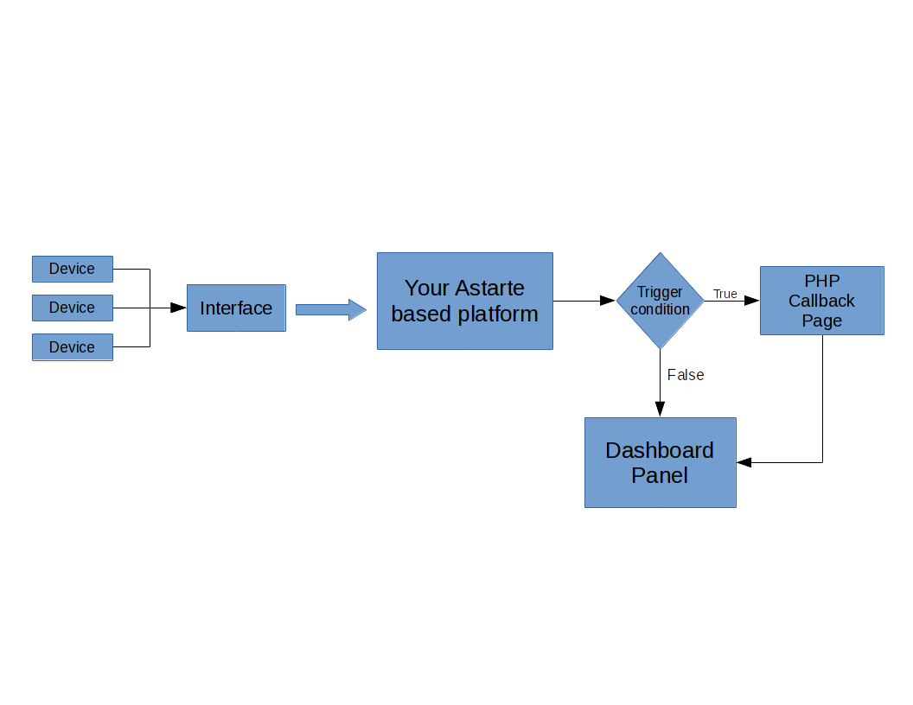
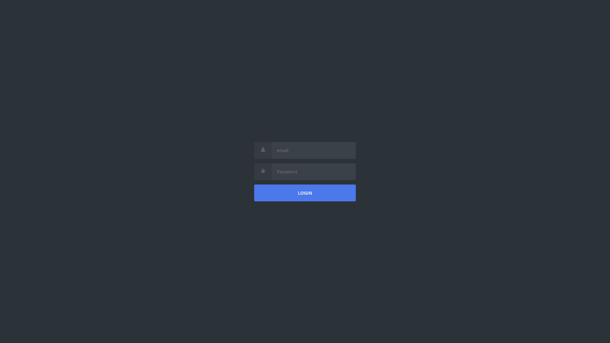
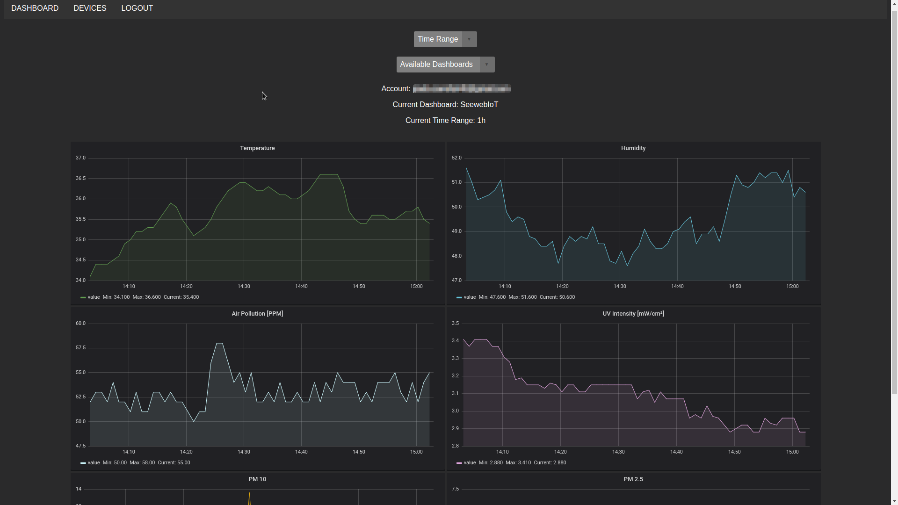
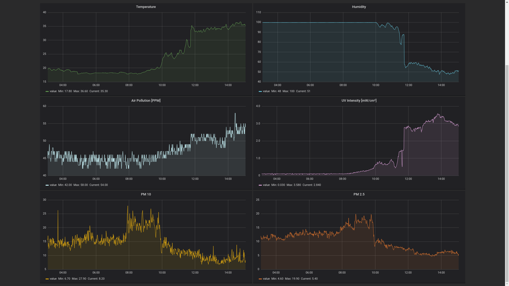
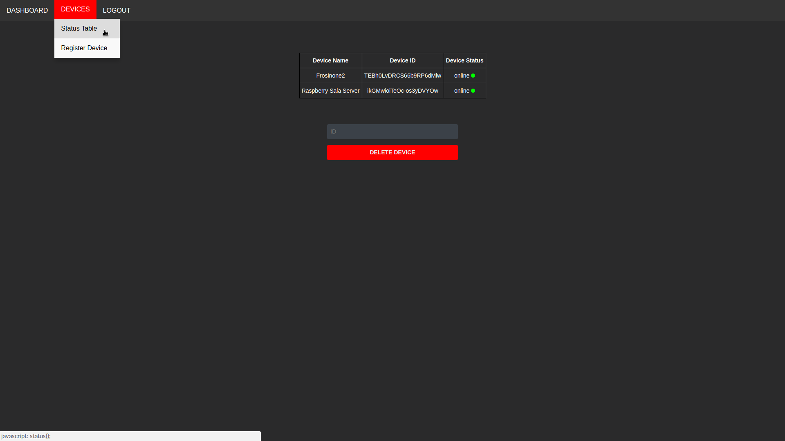

 
# Seeweb IoT demo project  

SeewebIoT demo project is an example project with the aim of explain how to use SeewebIoT service, Qt5 and raspberry Pi to build an IoT project. Even if you're not an expert, you'll be able to make your first IoT projet easily. The step by step guide to setup your first IoT project is available in `docs/`.

## Hardware used in this project

* Raspberry Pi zero
* Arduino NANO
* DHT22 humidity and temperature sensor
* MQ135 air quality sensor
* UV intensity sensor
* 5V to 3.3V logic converter circuit
* SDS011 nova dust sensor

## Software used in this project

* SeewebIoT
* Astarte
* Astarte SDK for QT5
* QT5
* Arduino IDE
* Postman
* Laravel (Control Panel)

## Data collection Flowchart

## Preview screenshots
#### Login Page

#### Main page (Dashboard)

#### Devices list page

