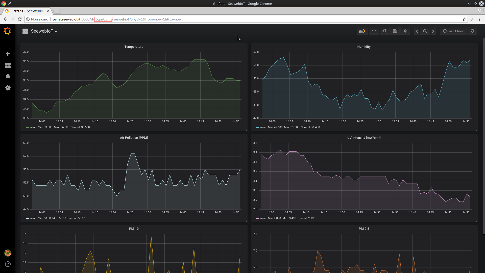

# An easy guide to use Astarte with an example of IoT project

This guide aims to explain how to implement Seeweb IoT solution in your IoT projects. An Air quality monitoring example project made with Arduino and Raspberry PI will be used to make the concept clearer.

## Configuring Astarte environment

### Introduction to interfaces

Interfaces define how data is exchanged over Astarte. For a Device to be capable of exchanging data into its Realm, its interfaces have to be registered into the Realm First.
Interfaces are described using JSON document. Each of them is identified by a unique name of maximum 128 characters, which must be a Reverse Domain Name.

```
{
	"interface name" : "com.test.InterfaceName",
	"version_major": 1,
	"version_minor": 0,
	[...]
}
```

Interfaces have a predefined type, which can be either property or datastream. Every Device in Astarte can have any number of interfaces of any different type.

**Datastream:** represents a mutable, ordered stream of data, with no concept of persistent or synchronization. This kind of interfaces should be used when dealing with	values such as a sensor samples, commands and events. Datastreams are stored as time series in the database, making them suitable for time span filtering and any other common time series operation, and they are not idempotent in the REST API semantics. Due to their nature, datastream interfaces have a number of additional properties which fine tune their behavior.

**Properties:** represent a persistent, stateful synchronized state with no concept of history and timestamping. Properties are useful when dialing with settings, states or policies/rules. They are stored in a key-value fashion, and grouped according to their interface, and they are idempotent in the REST API semantics. Rather than being able to act on a stream like in the datastream case, properties can be retrieved, or can be used as a trigger whenever they change. Values in a properties interface can be unset (or deleted according to the http jargon): to allow such a thing, the interface must have its allow_unset property set to true.

The owner of an interface has a write-only access to it, whereas other actors have read-only access. Interface ownership can be either `device` or `server`
Every interface must have an array of mappings. Each mapping describes an endpoint which is resolved to a path, it is strongly typed, and can have additional options. Any endpoint can support any number of parameters.

This is a list of every endpoint type suppported:

	- Double
	- Integer
	- boolean (true or false)
	- longInteger
	- string
	- binaryblob
	- datetime
	- doublearray

The following example is the JSON document which describes an example interface:

```
{
    "data": {
      "version_minor": 2,
      "version_major": 0,
      "type": "properties",
      "ownership": "device",
      "mappings": [
        {
          "type": "integer",
          "path": "/myValue",
          "description": "This is quite an important value."
        },
        {
          "type": "integer",
          "path": "/myBetterValue",
          "description": "A better revision, introduced in minor 2, supported only by some devices"
        },
        {

          "type": "boolean",
          "path": "/awesome",
          "allow_unset": true,
          "description": "Introduced in minor 1, tells you if device is awesome. Optional."
        }
      ],
      "interface_name": "com.my.Interface1"
    }
}

```


## Managing Interfaces

This part of the guide uses Postman to speed up and simplify the use of HTTP requests.

### Installing an interface

Once Postman is installed, select the POST protocol and write your path to interfaces. The right format for interfaces path is the following:

```
<realm name>.api.<your astarte domain>/v1/<realm name>/interfaces/
```

After typing the interface url, set the authorization type to `Bearer Token`, and insert your personal token (REALM type), provided at time of purchase.

Now paste your JSON document which describes your interface in the `Body` section.

At this point it's possible to send the call, it should return a 201 Created or an error. Most common failure causes are:

	- The interface already exists in this realm
	- The interface schema fails validation
	- The interfaces path is wrong

### Get a list of installed interfaces

To get a list of installed interfaces, change the Postman protocol to GET, use the same interfaces Path and same authorization parameter. If the interfaces was successfully created, something like this will be returned:

```
{
	"data": [
		"com.api.realmName.interfaceName"
	]
}
```
if you add the interface name to the url you typed before, you'll get a list of all available major version number.
By adding also one of the major version number, you'll get the JSON document which describes the interface corresponding to that version.

### Updating an interface

Interfaces are supposed to change over time, and are dynamic. As such, they can be installed and updated. Interface installation means adding either a whole new interface (as in: an interface with a new name), or a new major version of an already known interface. Interface update means updating a specific, existing interface name/major version with a new minor version.

A Realm can hold any number of interfaces and any number of major versions of a single interface. It holds, however, only the latest installed minor version of each major version, due to the inherent compatibility of Semantic Versioning

To update an interface, issue a PUT protocol, with the same installation parameters in `/interfaces/<name>/<major_version>` endpoint of the realm. The call will return 201 Created or an error.

#### Interface major version change

If a device upgrades one of its interfaces to a new major version, the previous interface is parked and its data remains dangling.
Every API call, trigger or reference to the interface will always target the major version declared in the introspection, regardless of the fact that a more recent version might have been installed in the realm.

The interface introspection for each device must be inserted in JSON format in the `/ interfaces` directory, located in the same path as the client's execution file.

## Triggers
Triggers in Astarte are the go-to mechanism for generating push events. In contrast with AppEngine’s REST APIs, Triggers allow users to specify conditions upon which a custom payload is delivered to a recipient, using a specific `action`, which usually maps to a specific transport/protocol, such as HTTP.

Each trigger is defined by two main components: `condition` and `action`.

#### Condition
A condition defines the event (or chain of events) upon which an action is triggered. Astarte monitors incoming events and triggers a corresponding action whenever there is a match.

#### Action
Actions are triggered by a matching condition. An Action defines how the event should be sent to the outer world (e.g. an http POST on a certain URL). In addition, most actions have a Payload, which carries the body of the event.

### Install a trigger
Installing a trigger is easy. Simply make a HTTP POST to your realm url (adding `/triggers`), with JSON document in the request body. There are two types of triggers: `device_trigger` and` data_trigger`, the first is handled by events connected to the device, the second by events is a set of values in the path specified in the interface. Every official documentation about the JSON configuration of a trigger is available at [this link](https://docs.astarte-platform.org/snapshot/api/index.html?urls.primaryName=Realm%20Management%20API). In this configuration example, a POST will be sent to a URL of our choice every time our device connects to astarte. The following trigger configuration sends an `POST` request to a specific url every time the devices connects to the interface.
```
{
    "data": {
        "simple_triggers": [
            {
                "type": "device_trigger",
                "on": "device_connected",
                "device_id": "YOUR_ID_HERE"
            }
        ],
        "name": "mytrigger_seewebIoT",
        "action": {
            "http_post_url": "http://example.com"
        }
    }
}
```
The following is an example of a trigger that is activated whenever the measured value of the UV rays exceeds 0.17 mV / cm², indicating the sunrise.
```
{
    "data": {
        "simple_triggers": [
            {
                "type": "data_trigger",
                "on": "incoming_data",
                "interface_name": "INTERFACE_NAME_HERE",
                "interface_major": "2",
                "match_path":"/uvint",
                "known_value":"0.17",
                "value_match_operator": ">="
            }
        ],
        "name": "data_Trigger",
        "action": {
            "http_post_url": "http://example.com/data_trigger.php"
        }
    }
}
```

###### NOTICE:
Due to how triggers work, it is fundamental to install the trigger before a device connects. Doing otherwise will cause the trigger to kick in at a later time, and as such no events will be streamed for a while.

### Get data from your Realm

To retrieve data from your astarte Realm, make a HTTP GET request at the following URL with Postman, authenticating with `AppEngine` token:

`<realm name>.api.<your astarte domain>/appengine/v1/<realm name>/devices/<your deviceid>/interfaces/<interfaceName>/<DataPath>`

Astarte will answer with a JSON document containig all registered data on provided device's interface.

## Getting ready to code Astarte client for straming data

### Installing necessary packages on Raspberry

To compile and install the Astarte SDK for QT5 framework, some packages are required: `python3-pip` `libqt5serialport5-dev` `libmosquittopp-dev` `qt5-qmake` `qt5-default` `cmake` `build-essential` `libssl-dev` `git`  `python3`  `pyserial (sudo pip install pyserial)`. After installing those packages, download `Astarte Qt5 Device SDK` from GitHub:

```git clone https://github.com/astarte-platform/astarte-device-sdk-qt5 ```

After downloading the sdk, move inside its folder and run the following commands to build and install it:
```
$ mkdir build
$ cd build
$ cmake -DCMAKE_INSTALL_PREFIX=/usr ..
$ make
$ make install

```
### Generate the device ID and create config file
Each device must be provided with an ID that can be generated by running `./generate-astarte-device-id`. Copy it and create a new folder for config file:
```
$ mkdir astarte-device-DEVICE_ID_HERE-conf
```
Now is necessary to create a new config file for astarte, named `transport-astarte.conf`, containing the following text:
```
[AstarteTransport]
agentKey=AGENT_KEY_HERE
endpoint=https://PAIRING_HOST_HERE/v1/REALM_HERE
persistencyDir=PERSISTENCY_DIR_HERE
```
Write the realm token in `agentKey=`.
Write your realm endpoint in `endpoint=`.
Write your persistencyDir in `persistencyDir=`, it must always exist because when the client will be registered to astarte by the SDK, every authentication file will be stored there. If `persistencyDir` folder will be deleted, the device won't be able to authenticate, and a QNetwork error will be returned by the client.

Once donce, install defined interface inside the folder `/clientFolder/interfaces`.

###### NOTICE:
The following part of the guide is written in C++ with QtCreator, if you're a beginner and you cannot understand the code, we provide a ready to use open source software. Skip to part `B)` of the guide, where will be explained what to edit to use your device and how the code works.   

### A) Writing a client for Astarte
#### First initialize your device:
When a Device connects successfully, it must subscribe to its server Interfaces. The SDK takes care of this detail and exposes a higher level interface.
Create a new Qt5 project and add the Astarte's libraries in the .pro file:
```
//Astarte Device SDK path
INCLUDEPATH += /usr/include/AstarteDeviceSDKQt5

//Add astarte necessary libraries
LIBS += -lmosquitto
LIBS += -lmosquittopp
LIBS += -lAstarteDeviceSDKQt5
```
Now add the header file in your main class:
```
#include <AstarteDeviceSDK.h>
#include <HemeraCore/Operation>
```

At this point, everything is ready to start writing the code! Here's a little example from our code:

```
sdk_Init::sdk_Init(){			//main function

    m_sdk = new AstarteDeviceSDK(QStringLiteral("/path/to/transport-astarte.conf"); QStringLiteral("/path/to/interfaces"), deviceId);
    connect(m_sdk->init(), &Hemera::Operation::finished, this, &AstarteStreamQt5Test::checkInitResult);
    connect(m_sdk, &AstarteDeviceSDK::dataReceived, this, &AstarteStreamQt5Test::handleIncomingData);
}

void sdk_Init::sendData(){
    qDebug() << "Ready to send!";
		m_sdk->sendData(interface, path, value);
}

void sdk_Init::checkInitResult(Hemera::Operation *op){
    if(op->isError())
    {
        qWarning() << "AstarteStreamQt5Test init error: " << op->errorName() << op->errorMessage();
    }else {
	sendData();
        timer->start();
    }
}

void sdk_Init::handleIncomingData(const QByteArray &interface, const QByteArray &path, const QVariant &value){
    qDebug() << "Received data, interface: " << interface << "path: " << path << ", value: " << value << ", Qt type name: " << value.typeName();

}
```

It's also possibile to call `sendData(interface, path, value)` function in another class by passing the `m_sdk `object.

### B) Use our open source client

To use our source code is easy, you only need to edit few lines to set up your DEVICE ID and your Interface name, but first it's necessary to explain its logic:
our client first reads a JSON file located in (data/data.json) containing Arduino sensors data, then once connection between client and Astarte has been established, data will be sent in the interface path data path corresponding to value index name.
To set your device ID and the interface name, edit the file `sdk_init.h`. Once done, compile the code with the following commands:

```
$ qmake
$ make
```

## Use our example project
### Assemble ciruit
Circuit scheme and Arduino code are available in `/src/arduino_code`. Arduino board will grab data from sensors and will send them to Raspberry Pi in JSON format. Raspberry Pi will read data through serial from both Arduino and SDS011 (PM sensor) and save it to `/data/data.json` using python3 script `data_collector.py`.

## Use Grafana to draw charts out of received value
`Grafana Server` will already be installed on your host. Grafana control panel will be accessible through URL and credentials provided at time of purchase. Astarte datasource plugin will be already configured. It will be possible to create new dashboard and panels. To add a new panel you have to select chart type, choose datasource and set query parameters (Device ID, interface name, data path).

## PHP callback page example

Triggers that make HTTP POST requests to a URL can be managed simply through PHP pages. Below is a sample script that saves data sent via HTTP POST.

```
<?php
// get the POST body with php://input
$received = file_get_contents("php://input");

// encode to json
$json_output = json_decode($received, true);

// save json data to a file
$file_handle = fopen('over_temp.json', 'w');
fwrite($file_handle, $received);
fclose($file_handle);
?>
```
The triggers provide JSON format all the data concerning the event that cause it to be activated in JSON format. These are read from the script and saved in a JSON document. The following is an example of the data provided by a trigger triggered by the `device_connected` event:

```
{
		"timestamp":"2018-08-17T13:04:42.706575Z",
		"event":
		{
			"type":"device_connected",
			"device_ip_address":"IP"
		},
		"device_id":"2UZn1kJYQRutYe4Pk9HR_Q"
	}
```

### Get dashboard ID & API token from Grafana panel

To use the panel, you will first need to configure the dashboard on Grafana and create a token API. Once you have created a dashboard, you will be able to read its ID in the page URL.



Once you have made a note of the dashboard ID, you need to create a Token API. This operation can be performed under the `settings -> Api keys` entry.
Once a key has been added, it will only be possible to display it at the moment of creation, so you have to take note.

At this point you can add your dashboard to the panel under the appropriate menu item.


Now you will need to enter the required dashboard data. Once added, in the home page you can view all the panels in your dashboard. You can add more dashboards with the same procedure and choose which view to display the appropriate `selector`.

### Ottenere lo status di un device tramite triggers

To view the status of a device, you must first register it. To do this you can use the `DEVICES -> Register device` menu and enter the required data.
At this point, the device will be visible in `DEVICES -> status Table`. By creating a `device_trigger` trigger with astarte and setting the target variable url to` <panel url> / status_trigger`, the status of the device will be updated automatically according to the chosen event (device_connected, device_disconnected or device_error).
