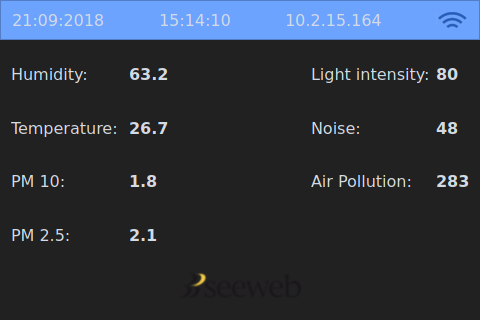

# SeewebIoT Display version

Here there is the source code for a second example device, with a 3.5" display and different sensors from the normal version. It uses a `Raspbery Pi`, `Arduino Nano` and `nova dust sensor SDS011` to measure `temperature`, `humidity`, `Air Pollution`, `Light Percentage`, `PM 2.5`, `PM 10` and `Noise`. The arduino code and circuit can be found in `code and circuit/` folder. It basically needs the same library packages of SeewebIoT application.

## Hardware used in this project

- Raspberry Pi zero
- Arduino NANO
- DHT22 humidity and temperature sensor
- MQ135 air quality sensor
- UV intensity sensor
- 5V to 3.3V logic converter circuit
- SDS011 nova dust sensor

## How it Works?

The working process is really simple, it catches data from `data/data.json` file, this means the executable file has to be moved inside the Astarte client folder. This version works only with the json configuration generated by `data_reader.py` script and arduino code in `code and circuit/arduino_code/arduino_code.ino`, but editing the code is enough simple to adapt it for your own needs.

### Compiling source

Remember to install SeewebIoT QT5 basics libraries to compile the project source!

```
$ sudo apt-get install qtdeclarative5-dev
$ qake
$ make
```

##### NOTICE:
This application DOES NOT send data to Astarte, you have to run your Astarte client in background.

## Preview


